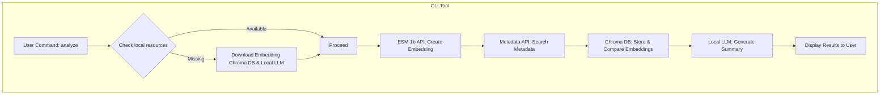

# bioai-seq

`bioai-seq` is a lightweight command-line tool for basic biological sequence analysis. It’s part of my journey toward becoming a **Bio AI Software Engineer** - combining software engineering, biology, and AI.

It's designed to provide information about

---

## How to install

### 1. Create and activate a virtual environment

```bash
python3 -m venv venv
source venv/bin/activate  # On Windows: venv\Scripts\activate
```

### 2. Install bioai-seq

```bash
pip install --upgrade bioai-seq
bioseq
```

---

## Deploying to PyPI (Production)

### 1. Clean previous builds

```bash
rm -rf dist build *.egg-info
```

### 2. Build the package

```bash
python3 -m build
```

### 3. Upload to PyPI

```bash
pip install --upgrade twine
twine upload dist/*
```

- Username: `__token__`
- Password: your API token from [https://pypi.org/manage/account/token/](https://pypi.org/manage/account/token/)

---

## Flow Chart



## 🧪 Planned Example Output

```txt
✅ Sequence loaded: 1273 amino acids
🧬 Detected: SARS-CoV-2 spike glycoprotein (likely variant: Omicron)

🔍 Running ESM-2 embeddings...
📦 Comparing against 1000 proteins in vector database...
📚 Top similar sequences:
 - UniProt P0DTC2 (99.8%) — SARS-CoV-2 spike glycoprotein
 - UniProt A0A6H2L9T9 (98.9%) — Bat coronavirus spike protein
 - UniProt A0A2X1VPJ6 (97.5%) — Pangolin coronavirus S protein

------------------------------------------------------------

🔬 Matched Protein Metadata: P0DTC2
🌍 Organism: SARS-CoV-2
🧬 Gene names: S, spike
🧫 Host organisms: Human, Bat
📖 Description: Spike glycoprotein mediates viral entry via ACE2
🏷️ Keywords: Receptor-binding, Glycoprotein, Fusion protein
🔎 Protein evidence: Evidence at protein level

🧩 Features:
 - Signal peptide: 1–13
 - Transmembrane region: 1213–1237
 - RBD domain: 319–541

🔗 External references:
 - [PDB: 6VSB](https://www.rcsb.org/structure/6VSB)
 - [RefSeq: YP_009724390.1](https://www.ncbi.nlm.nih.gov/protein/YP_009724390.1)
 - [Pfam: PF01601](https://www.ebi.ac.uk/interpro/entry/pfam/PF01601)
 - [AlphaFold model](https://alphafold.ebi.ac.uk/entry/P0DTC2)
 - [UniProt entry](https://www.uniprot.org/uniprotkb/P0DTC2)

------------------------------------------------------------

🧠 Summary:
"This sequence matches the SARS-CoV-2 spike glycoprotein. It binds to the ACE2 receptor to mediate viral entry. The receptor binding domain (RBD) spans residues 319–541 and contains key mutations in Omicron variants. The protein is expressed in humans and bats."
```

---

## Follow the Journey

- 🌍 Blog: [https://bioaisoftware.engineer](https://bioaisoftware.engineer)
- 🧑‍💻 GitHub: [https://github.com/babilonczyk](https://github.com/babilonczyk)
- 💼 LinkedIn: [https://www.linkedin.com/in/jan-piotrzkowski/](https://www.linkedin.com/in/jan-piotrzkowski/)

---

## License

Apache 2.0 - free to use, and improve.
